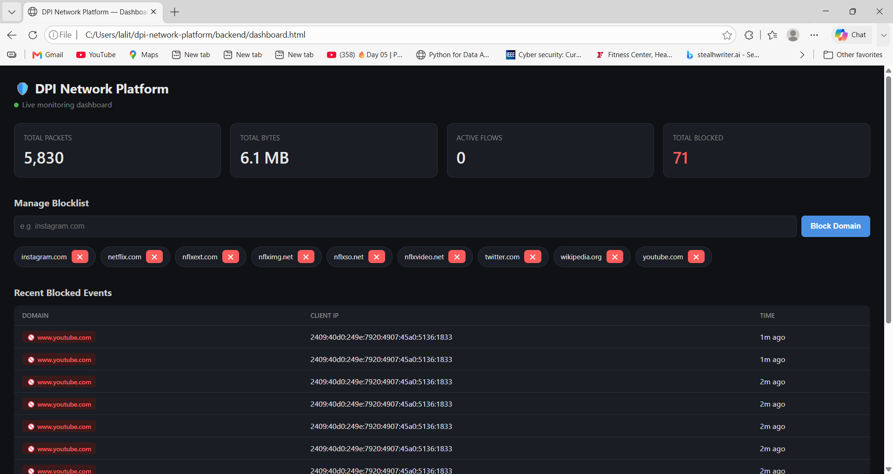
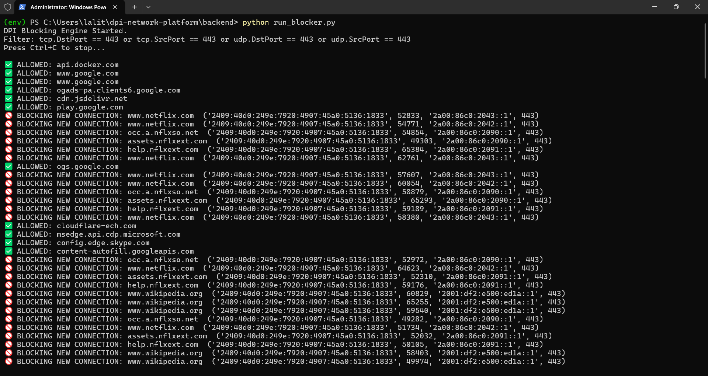
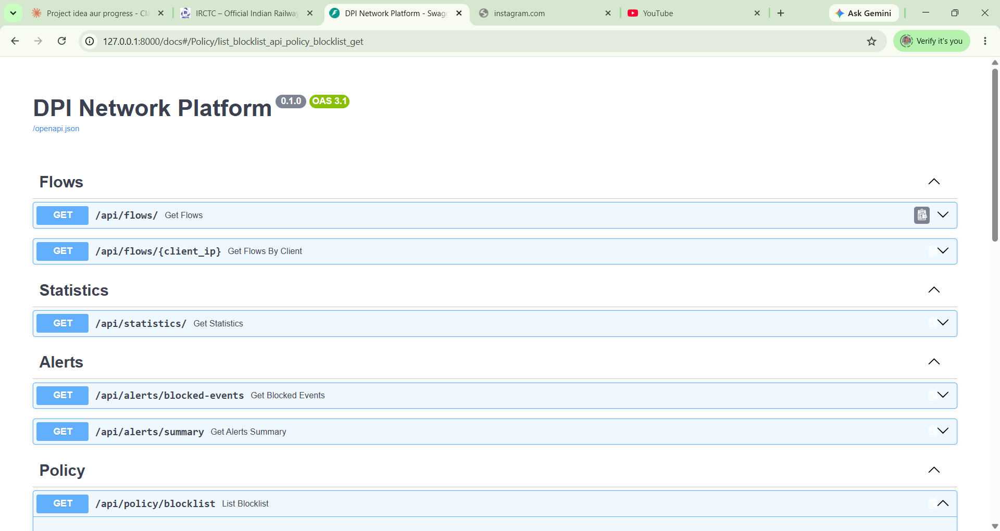

# 🛡️ DPI Network Platform

A real-time **Deep Packet Inspection (DPI)** system that captures live network traffic, extracts hostnames from encrypted HTTPS connections via TLS SNI parsing, and enforces domain-based blocking directly at the OS level — similar to how ISPs, hostels, and enterprise firewalls filter traffic.

> Built from scratch to understand how network-level content filtering actually works — from raw packets to policy enforcement to a live dashboard.

---

## ✨ What it does

- Captures live network traffic (IPv4 + IPv6) directly from the network interface
- Parses TLS `ClientHello` packets to extract the **SNI (Server Name Indication)** — the hostname being requested, even though the connection is encrypted
- Tracks bidirectional flows using 5-tuple connection identity (source IP/port, destination IP/port, protocol)
- Checks each hostname against a live, Redis-backed blocklist
- **Actively blocks** matching connections by injecting TCP RST packets at the OS level (not just logging — real enforcement)
- Handles QUIC/HTTP3 fallback (forces browsers back to inspectable TCP/TLS)
- Reassembles fragmented TLS handshakes that span multiple TCP packets
- Exposes everything through a REST API and a live-updating dashboard

---

## 📸 Screenshots

**Live dashboard** — real-time stats, blocklist management, and a feed of recently blocked connections:



**Active blocking in action** — `run_blocker.py` intercepting live traffic, extracting SNI, and allowing/blocking in real time:



**Interactive API docs** — auto-generated Swagger UI for every endpoint:



---

## 🏗️ Architecture
                NETWORK TRAFFIC
                      │
                      ▼
          ┌───────────────────────┐
          │   Packet Capture       │  (Scapy)
          │   IPv4 / IPv6          │
          └───────────┬───────────┘
                      │
                      ▼
          ┌───────────────────────┐
          │   TLS SNI Parser       │  (manual byte-level parser,
          │   + Flow Reassembly    │   handles fragmented ClientHello)
          └───────────┬───────────┘
                      │
                      ▼
          ┌───────────────────────┐
          │   Policy Engine        │  (Redis Set — live blocklist)
          │   ALLOW / BLOCK        │
          └───────────┬───────────┘
                      │
          ┌───────────┴───────────┐
          ▼                       ▼

┌─────────────────┐ ┌─────────────────────┐
│ Passive Mode │ │ Active Mode │
│ (Scapy sniff) │ │ (pydivert/WinDivert) │
│ Log & analyze │ │ Inject TCP RST → │
│ │ │ actually drop conn. │
└─────────┬───────────┘ └───────────┬───────────┘
│ │
└──────────────┬──────────────┘
▼
┌───────────────────┐
│ Redis │ (flows, blocked events,
│ │ live blocklist, stats)
└──────────┬──────────┘
▼
┌───────────────────┐
│ FastAPI │ (REST API)
└──────────┬──────────┘
▼
┌───────────────────┐
│ Live Dashboard │ (HTML/JS, auto-refresh)
└───────────────────┘


---

## 🧰 Tech Stack

| Layer               | Technology                          |
|----------------------|--------------------------------------|
| Packet Capture        | Scapy, Npcap                        |
| Active Enforcement    | pydivert (WinDivert)                |
| Backend API            | FastAPI, Pydantic, Uvicorn          |
| Cache / Live Storage   | Redis (Docker)                      |
| Language                | Python 3.12                         |
| Frontend                | Vanilla HTML/CSS/JS (no build step) |

---

## 📁 Project Structure

backend/
├── app/
│ ├── main.py # FastAPI entrypoint
│ ├── core/
│ │ ├── config.py # Settings (.env driven)
│ │ └── redis.py # Redis client
│ ├── api/
│ │ ├── flows.py # GET /api/flows
│ │ ├── statistics.py # GET /api/statistics
│ │ ├── alerts.py # GET /api/alerts/*
│ │ └── policy.py # GET/POST/DELETE /api/policy/blocklist
│ └── schemas/ # Pydantic request/response models
│
├── dpi/
│ ├── capture/
│ │ └── sniffer.py # Passive packet capture (Scapy)
│ ├── parser/
│ │ └── packet_parser.py # 5-tuple + TLS SNI extraction
│ ├── flows/
│ │ └── flow_tracker.py # Bidirectional flow tracking → Redis
│ ├── policies/
│ │ └── blocklist.py # Redis-backed live blocklist
│ └── enforcement/
│ └── blocker.py # Active blocking via pydivert
│
├── dashboard.html # Standalone live dashboard
├── run_capture.py # Entry point: passive monitoring
├── run_blocker.py # Entry point: active blocking
└── requirements.txt


---

## 🚀 Getting Started

### Prerequisites

- Windows 10/11 (uses Npcap + WinDivert, both Windows-specific)
- Python 3.12+
- [Docker Desktop](https://www.docker.com/products/docker-desktop/) (for Redis)
- [Npcap](https://npcap.com/#download) — install with *"WinPcap API-compatible mode"* checked
- **Administrator privileges** (required for raw packet capture and blocking)

### 1. Clone & install dependencies

```bash
git clone https://github.com/Luckybisht2811/dpi-network-platform.git
cd dpi-network-platform/backend
python -m venv env
env\Scripts\activate
pip install -r requirements.txt
```

### 2. Start Redis

```bash
docker run -d --name dpi-redis -p 6379:6379 redis:latest
```

### 3. Configure environment

Create a `.env` file in `backend/`:

```env
APP_NAME=DPI Network Platform
DEBUG=True
REDIS_HOST=localhost
REDIS_PORT=6379
REDIS_DB=0
CAPTURE_INTERFACE=Wi-Fi
```

### 4. Run the components (each in its own terminal)

**Terminal 1 — API server:**
```bash
uvicorn app.main:app --reload
```

**Terminal 2 — Passive capture (optional, for monitoring only):**
```bash
python run_capture.py
```

**Terminal 3 — Active blocker (requires Administrator terminal):**
```bash
python run_blocker.py
```

### 5. Open the dashboard

Just double-click `dashboard.html` — it connects to the API at `http://127.0.0.1:8000` automatically.

---

## 📡 API Reference

| Method | Endpoint                          | Description                          |
|--------|-------------------------------------|----------------------------------------|
| GET    | `/api/flows/`                       | List tracked network flows            |
| GET    | `/api/flows/{client_ip}`            | Flows for a specific client           |
| GET    | `/api/statistics/`                  | Total packets, bytes, active flows    |
| GET    | `/api/alerts/blocked-events`        | Recent blocked connections            |
| GET    | `/api/alerts/summary`               | Blocked traffic breakdown by domain/client |
| GET    | `/api/policy/blocklist`             | Current blocklist                     |
| POST   | `/api/policy/blocklist`             | Add a domain to the blocklist         |
| DELETE | `/api/policy/blocklist/{domain}`    | Remove a domain from the blocklist    |

Interactive docs available at `http://127.0.0.1:8000/docs` (Swagger UI).

---

## 🔍 How the blocking actually works

1. WinDivert intercepts outbound/inbound packets on port 443 (TCP + UDP) at the network layer, before they reach the OS network stack
2. When a TCP `ClientHello` is seen, the SNI is extracted (with reassembly across fragmented packets if needed)
3. The hostname is checked against the live blocklist in Redis
4. If blocked, the connection is added to a block-set and a forged **TCP RST** packet is sent back to the client, immediately terminating the connection
5. QUIC (HTTP/3, which runs over UDP and can't be SNI-inspected the same way) is blocked outright on port 443, forcing browsers to fall back to inspectable TCP/TLS

---

## ⚠️ Known Limitations

- Encrypted Client Hello (ECH), used by some Cloudflare/Google services, hides the SNI entirely and cannot be inspected by this or any SNI-based method
- TLS session resumption / connection reuse means an already-open connection to an allowed domain won't be re-inspected until it closes
- Windows-only (Npcap + WinDivert are Windows-specific; a Linux port would use `iptables`/`NFQUEUE` instead)
- This is a local/on-prem tool by design — raw packet interception requires OS-level privileges that cloud platforms don't grant, so it cannot be deployed as a public web app

---

## 🗺️ Roadmap

- [ ] PostgreSQL for long-term historical storage (Redis is intentionally ephemeral)
- [ ] Per-IP bandwidth rate-limiting (throttling, not just block/allow)
- [ ] Multi-worker packet distribution via flow hashing (load balancing across capture threads)
- [ ] QUIC-aware SNI inspection (currently blocked wholesale rather than inspected)

---

## 📄 License

MIT — built as a learning project to understand DPI, TLS, and network-layer enforcement from first principles.
